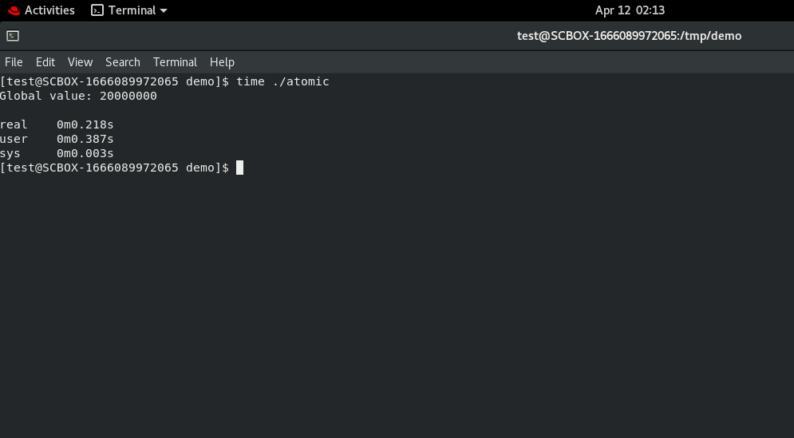
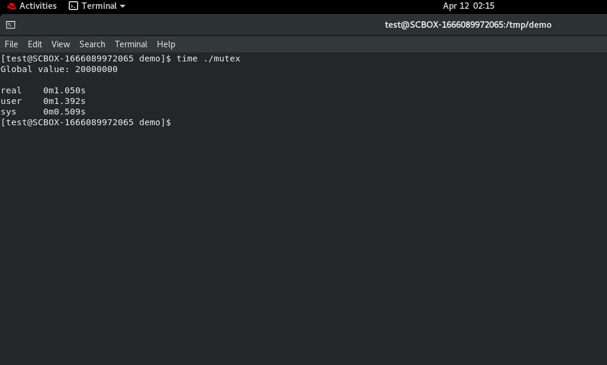

# Concurrent_Performance_Test
    - This repo will test the performance between blocking and non -blocking syncronization.
    - All program will be written in cpp.

# Environment
    CPU: x86_64 with 4 cores
    OS : Redhat
    RAM: 32GB
    Storage: 50GB
    
# Result in atomic

# Result in mutex

# Conclusion
    As you see atomic is more efficient than using mutex to update shared resource.
 

    
    
